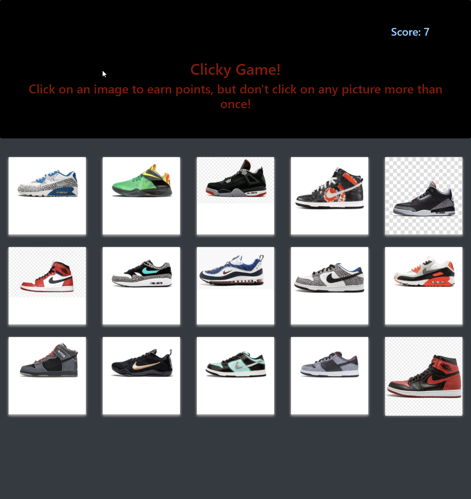

# Clicky Shoes

-----------------------
## Table of Contents
1. [Description](#description)
2. [Deployed link](#deployed-link)
3. [Code snippets](#code-snippets)
4. [Licenses](#licenses)
5. [Questions](#questions)

-----------------------
## Description
A clicky game made using JQuery. The object of the game is to not click on the same card picture more than once, otherwise it's game over! Each individual shoe card was rendered dynamically.


-----------------------
## Deployed link
[Link]()

-----------------------
## Code snippets

```javascript
    render() {
        return (
            <div>
                <Jumbotron
                  alert={this.state.alert}
                  score={this.state.score}
                />
                <Wrapper>
                    {this.state.shoes.map(shoe => (
                        <Card
                            key={shoe.id}
                            id={shoe.id}
                            name={shoe.name}
                            image={shoe.image}
                            clicked={this.clicked}
                        />
                    ))}

                </Wrapper>
            </div>
        )
    }
```
The render function in the App.js file brings all of the compenents together into one parent element. To render the shoe cards, a "shoes.json" file was imported and the elements associated with each element were explicitly stated(shoe.id, shoe.name, etc). To jumbotron element has two children elements that indicate a players score as well as the pertaining message whether they are still playing or have lost.

-----------------------
## Licenses
This project uses a [MIT License](https://opensource.org/licenses/MIT). 

-----------------------
## Questions
Created by Michael Medina

If you have any questions you can reach me at the following: 


[michaelanthony.medinaa@gmail.com](mailto:michaelanthony.medinaa@gmail.com)  |[LinkedIn](https://www.linkedin.com/in/michaelanthonyy/) | [GitHub](https://github.com/michaelanthonyyy)  |

